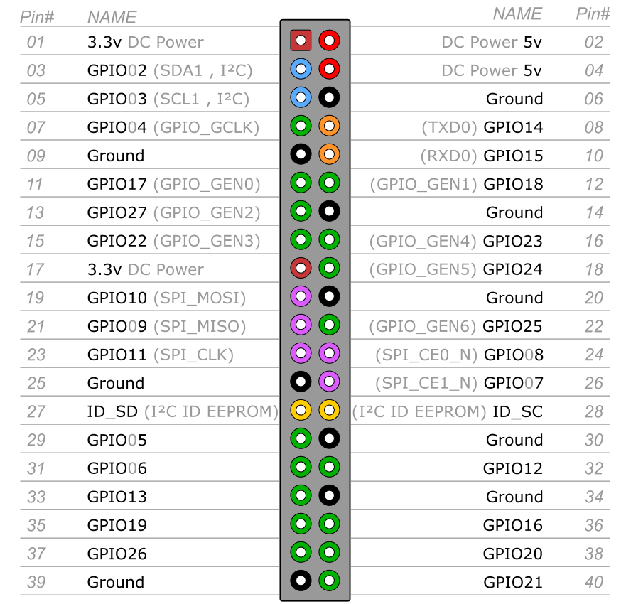

```python title="gpio.py"
# pip install rpi.gpio
import time

import RPi.GPIO as GPIO

# https://blog.csdn.net/guzhong10/article/details/80119322

# gpio mode 0 out
# gpio write 0 1


GPIO.setwarnings(False)

GPIO_PIN = 26

GPIO.setmode(GPIO.BCM)
GPIO.setup(GPIO_PIN, GPIO.OUT)

# L_Motor = GPIO.PWM(GPIO_PIN, 100)
# L_Motor.start(0)

while True:
    GPIO.output(GPIO_PIN, GPIO.HIGH)
    time.sleep(.5)
    print(GPIO.input(GPIO_PIN))

# while True:
#     GPIO.output(i, 1)
#     time.sleep(1)
#     GPIO.output(i, 0)
#     time.sleep(1)
```

```python title="run.py"
import time

import RPi.GPIO as GPIO

GPIO.setmode(GPIO.BCM)  # 设置引脚的编码方式

delay = 5  # delay 2ms

pin_1 = 6
pin_2 = 13
pin_3 = 19
pin_4 = 26


def init():
    GPIO.setwarnings(False)
    GPIO.setup(pin_1, GPIO.OUT)
    GPIO.setup(pin_2, GPIO.OUT)
    GPIO.setup(pin_3, GPIO.OUT)
    GPIO.setup(pin_4, GPIO.OUT)


def forward(delay):
    setStep(1, 0, 0, 0)
    time.sleep(delay)
    setStep(0, 1, 0, 0)
    time.sleep(delay)
    setStep(0, 0, 1, 0)
    time.sleep(delay)
    setStep(0, 0, 0, 1)
    time.sleep(delay)


def setStep(w1, w2, w3, w4):
    # print(w1, w2, w3, w4)
    GPIO.output(pin_1, w1)
    GPIO.output(pin_2, w2)
    GPIO.output(pin_3, w3)
    GPIO.output(pin_4, w4)


init()
while True:
    forward(delay / 1000.0)
```

```python title="test.py"
import time

import RPi.GPIO as GPIO

delay = 5  # delay 2ms

pin_1 = 6
pin_2 = 13
pin_3 = 19
pin_4 = 26
pin_1 = 26
pin_2 = 19
pin_3 = 13
pin_4 = 6

GPIO.setmode(GPIO.BCM)  # 设置引脚的编码方式


def init():
    GPIO.setwarnings(False)
    GPIO.setup(pin_1, GPIO.OUT)
    GPIO.setup(pin_2, GPIO.OUT)
    GPIO.setup(pin_3, GPIO.OUT)
    GPIO.setup(pin_4, GPIO.OUT)


def forward(delay):
    setStep(1, 0, 0, 0)
    time.sleep(delay)
    setStep(0, 1, 0, 0)
    time.sleep(delay)
    setStep(0, 0, 1, 0)
    time.sleep(delay)
    setStep(0, 0, 0, 1)
    time.sleep(delay)


def setStep(w1, w2, w3, w4):
    # print(w1, w2, w3, w4)
    GPIO.output(pin_1, w1)
    GPIO.output(pin_2, w2)
    GPIO.output(pin_3, w3)
    GPIO.output(pin_4, w4)


def main():
    init()
    while True:
        forward(delay / 1000.0)


main()  # 调用main
```
